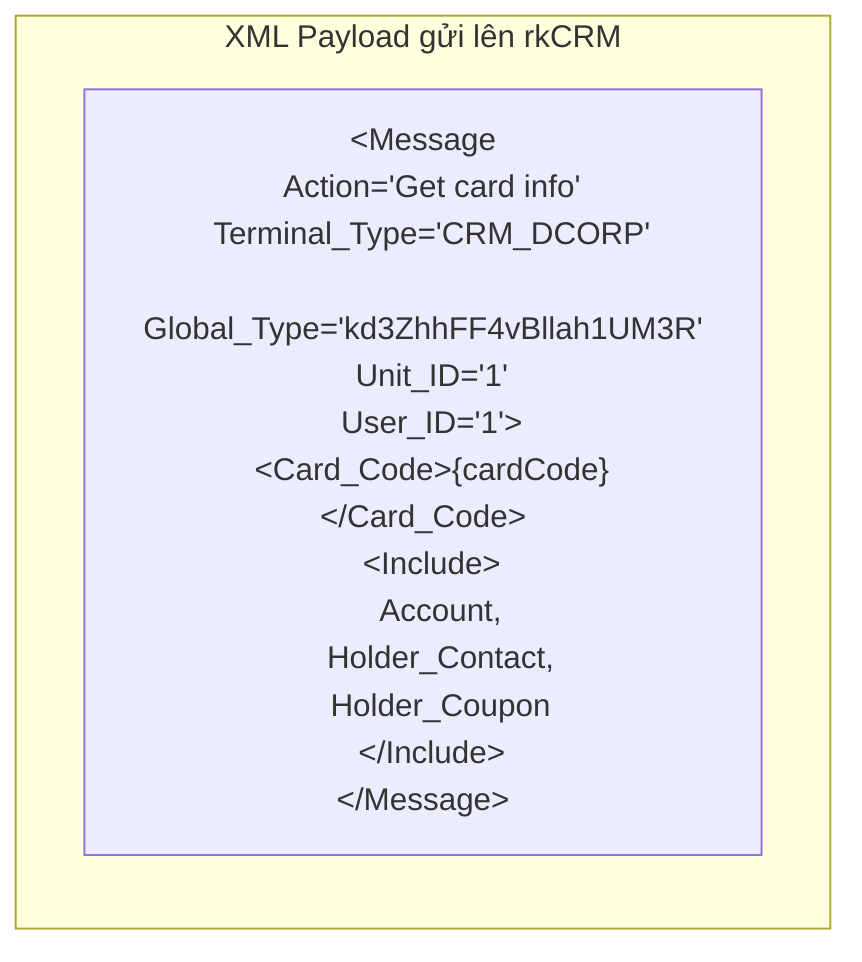
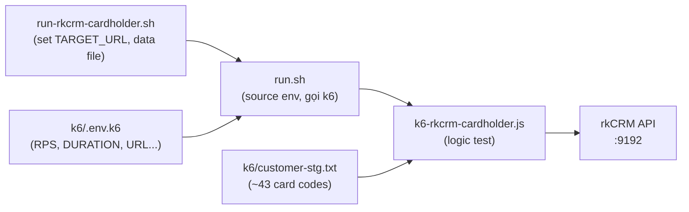

# Flow: rkCRM — Get Card Info (Cardholder)

> Mô tả luồng đầy đủ từ khi developer chạy lệnh đến khi nhận kết quả load test.

---

## Luồng tổng quan

```mermaid
flowchart TD
    A([👨‍💻 Developer]) --> B["Chạy lệnh\nnpm run test-rkcrm-cardholder"]

    B --> C["run-rkcrm-cardholder.sh\nSet biến môi trường:\n- TARGET_URL = TARGET_URL_RKCRM\n- COUPON_CODES_FILE = customer-stg.txt\n- SKIP_COUPON_FETCH = 1"]

    C --> D["run.sh\nSource k6/.env.k6\nLoad các biến: RPS, DURATION,\nPRE_VUS, MAX_VUS, ..."]

    D --> E{SKIP_COUPON_FETCH\n= 1 ?}

    E -- Có --> F["Dùng file data có sẵn\nk6/customer-stg.txt"]
    E -- Không --> G["node fetch-coupons.js\nQuery SQL Server\nCARD_COUPONS → file .txt"]
    G --> F

    F --> H["k6 run k6-rkcrm-cardholder.js"]

    H --> I["Init phase\nOpen customer-stg.txt\nLoad toàn bộ card codes\nvào memory"]

    I --> J["Spawn VUs\n(preAllocatedVUs = 100)"]

    J --> K["Mỗi iteration (constant-arrival-rate)\nRPS = 200 req/s\nDURATION = 2 phút"]

    K --> L["Random chọn 1 card code\ntừ danh sách đã load"]

    L --> M["buildXmlPayload(cardCode)\nBuild XML request"]

    M --> N["http.post TARGET_URL_RKCRM\nPOST XML → rkCRM API :9192"]

    N --> O{HTTP Response}

    O -- "2xx ✅" --> P["check passed\nstatus is 2xx"]
    O -- "4xx/5xx/timeout ❌" --> Q["check failed\nhttp_req_failed++"]

    P --> R{Còn trong\nDURATION?}
    Q --> R

    R -- Có --> K
    R -- Không --> S["k6 Summary Report\nin ra terminal"]

    S --> T{Thresholds\nPassed?}

    T -- "✅ Tất cả pass" --> U(["Test PASSED\nfail rate < 5%\np95 < 3s, p99 < 8s"])
    T -- "❌ Vi phạm" --> V(["Test FAILED\nIn chi tiết metric bị vượt"])
```



---

## Chi tiết XML gửi đi



---

## Các file liên quan



---

## Thresholds kiểm tra sau test

| Metric | Ngưỡng | Ý nghĩa |
|--------|--------|---------|
| `http_req_failed` | < 5% | Tỷ lệ request lỗi (4xx/5xx/timeout) |
| `http_req_duration p(95)` | < 3,000ms | 95% request phải trả về trong 3 giây |
| `http_req_duration p(99)` | < 8,000ms | 99% request phải trả về trong 8 giây |

---

## Lệnh chạy nhanh

```bash
# Chạy mặc định (200 RPS, 2 phút)
npm run test-rkcrm-cardholder

# Chạy nhẹ để smoke test (10 RPS, 30 giây)
RPS=10 DURATION=30s bash k6/run-rkcrm-cardholder.sh

# Dùng file card codes khác
RKCRM_CARD_CODES_FILE=./k6/my-cards.txt bash k6/run-rkcrm-cardholder.sh
```

---

## Customize payload qua env

| Env var | Mặc định | Thay đổi khi nào |
|---------|----------|-----------------|
| `RKCRM_CARDHOLDER_ACTION` | `Get card info` | Test action khác |
| `TERMINAL_TYPE` | `CRM_DCORP` | Test terminal type khác |
| `RKCRM_GLOBAL_TYPE` | `kd3ZhhFF4vBllah1UM3R` | Đổi global type |
| `RKCRM_UNIT_ID` | `1` | Test theo unit cụ thể |
| `RKCRM_USER_ID` | `1` | Test theo user cụ thể |
| `RKCRM_CARDHOLDER_INCLUDE` | `Account,Holder_Contact,Holder_Coupon` | Giảm/tăng payload Include |
| `RKCRM_CARD_CODES_FILE` | `customer-stg.txt` | Đổi file data |
